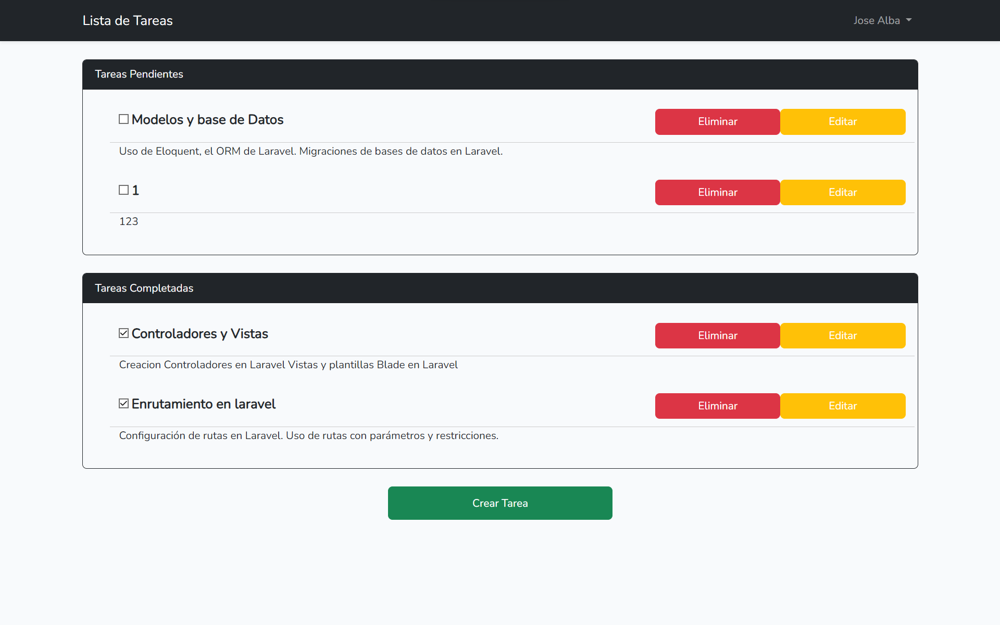
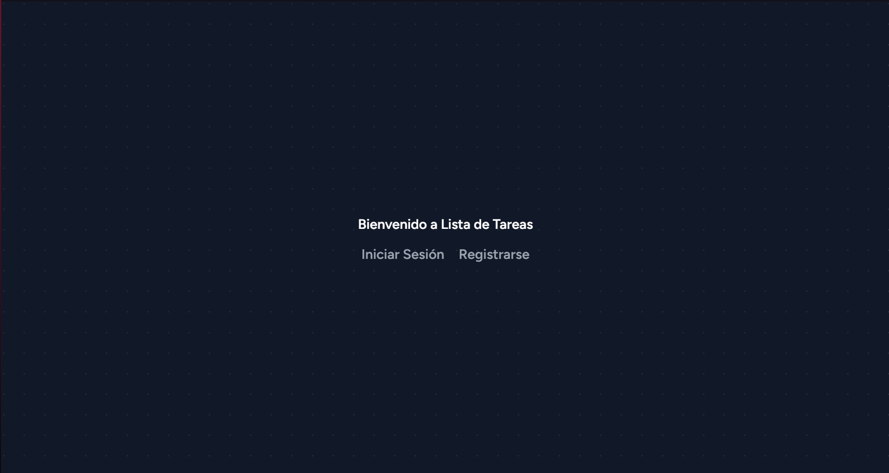
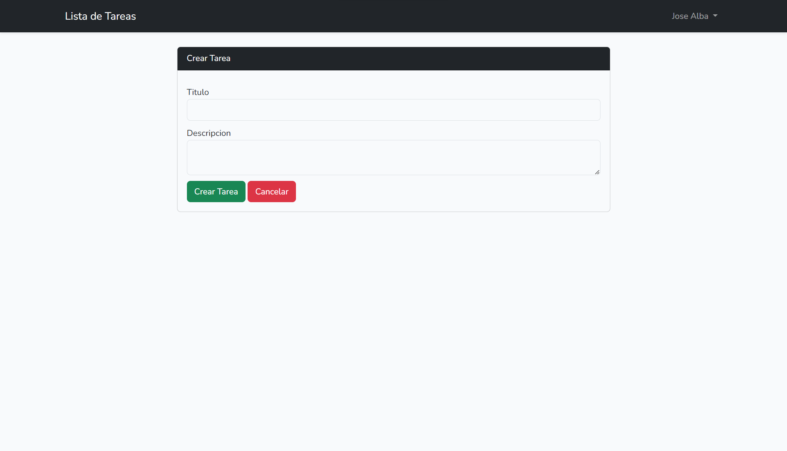
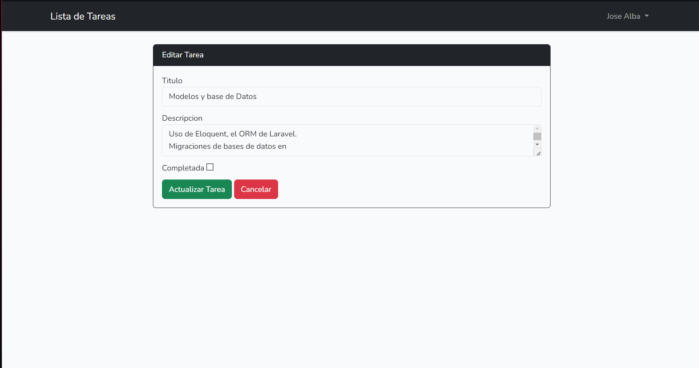

# UI Instalación

Estos comandos están relacionados con el framework de desarrollo web Laravel y se utilizan para facilitar la configuración inicial de un proyecto. Aquí hay una explicación detallada de cada comando:

1. **Instalación del paquete laravel/ui:**
   ```bash
   composer require laravel/ui

Este comando utiliza Composer, el administrador de dependencias de PHP, para instalar el paquete laravel/ui. Este paquete proporciona algunas herramientas para generar vistas y recursos de frontend (como estilos y scripts) en proyectos Laravel.
Generación de archivos de Bootstrap con 

## Autenticación:
2. **Creacion de authenticathor con ui y vite:**
   ```bash
    php artisan ui bootstrap --auth

### php artisan ui bootstrap:
 Genera archivos de recursos de frontend para el framework Bootstrap en tu aplicación Laravel. Creará archivos de diseño, estilos y scripts necesarios para utilizar Bootstrap en el frontend de tu aplicación.

### --auth:
 Modificador adicional que indica a Laravel que también debe generar vistas y controladores para la autenticación de usuarios, creando las páginas y controladores necesarios para la funcionalidad de registro e inicio de sesión.

#### Estos comandos resultan en la creación de 2 botones en la vista "welcome" y varias vistas.

## Login


## Register


## Archivos Generados o Modificados:

#### Modelos:
<ul>
<li>App/Models/Task.php: Modelo para las tareas en la aplicación.
</li>
<li>App/Models/User.php: Modelo para los usuarios de la aplicación.</li>
</ul>

#### Configuración de Base de Datos:
.env: Archivo de configuración de la base de datos.

#### Migraciones:
<ul>
<li> database/migrations/2023_10_22_141245_create_tarea_table.php: Migración para la creación de la tabla de tareas en la base de datos.</li>
</ul>

#### Controladores:
<ul>
<li> App/Http/Controllers/HomeController: Controlador principal de la página de inicio.
</li>
<li>App/Http/Controllers/TaskController: Controlador para la gestión de tareas.
</li>
</ul>

#### Rutas:
<ul>
<li>routes/web.php: Archivo de definición de rutas para la aplicación.</li></ul>

## Vistas:

### resources/views/home.blade.php: Vista para la página de inicio.


 
### resources/views/welcome.blade.php: Vista de bienvenida.



### resources/views/task/create.blade.php: Vista para la creación de tareas.



### resources/views/task/edit.blade.php: Vista para la edición de tareas.



#### Archivos Relacionados a Middleware y Autenticación (no presentados):
<ul>
<li>App/Http/Middleware</li>
<li>App/Http/Controllers/Auth</li>
<li>resources/views/auth</li>
</ul>